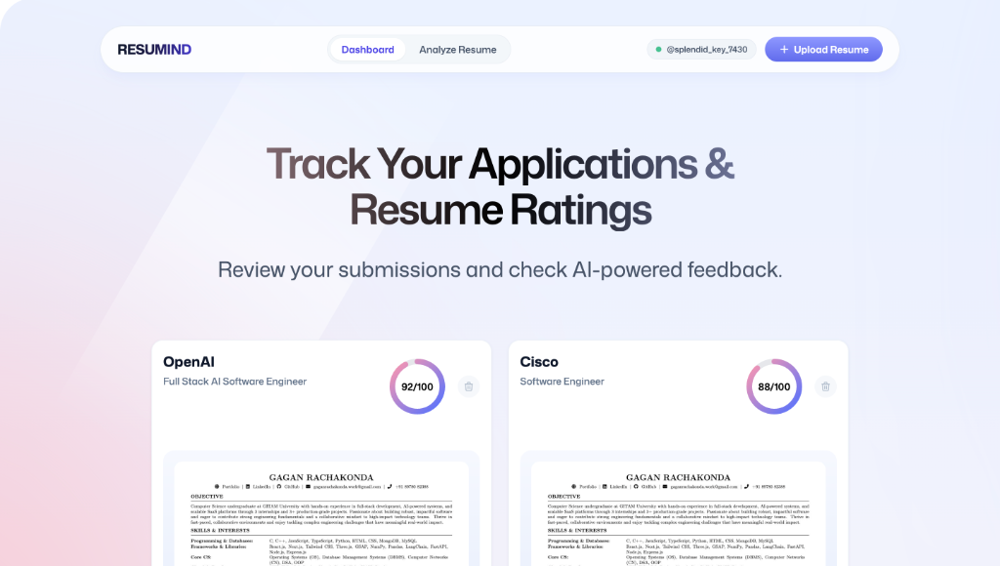
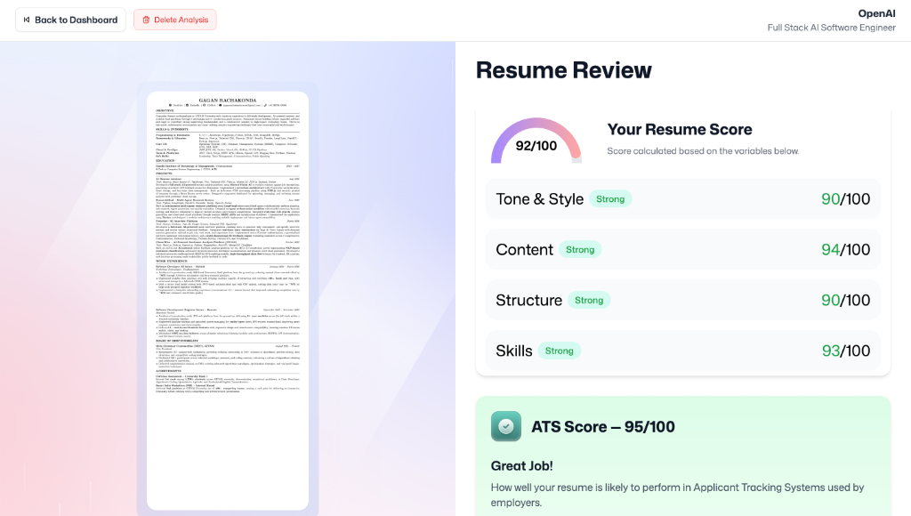

# Resumind — AI Resume & Job Target Analyzer

Resumind is an intelligent, privacy-first web application designed to evaluate resumes against target job descriptions using multimodal AI vision. Built with React, TypeScript, and Mistral AI Vision, Resumind provides comprehensive ATS keyword matching, formatting audits, score breakdowns, and actionable recommendations.

---

## Technical Stack

[](https://react.dev/)
[](https://www.typescriptlang.org/)
[](https://vitejs.dev/)
[](https://tailwindcss.com/)
[](https://mistral.ai/)
[](https://puter.com/)
[](https://github.com/pmndrs/zustand)
[](https://mozilla.github.io/pdf.js/)

---

## Product Screenshots

### Dashboard Overview
Track historical resume evaluations, view overall ATS compatibility scores, and manage past submissions.



### Detailed Resume Review & ATS Breakdown
Get granular ratings for Tone & Style, Content, Structure, Skills, and ATS Keyword optimization along with targeted feedback.



---

## Core Features

- **Multimodal AI Vision Analysis**: Utilizes Mistral's `pixtral-12b-2409` vision model to analyze resume documents accurately against employer requirements.
- **ATS Keyword Matching**: Computes structural scores and pinpoints missing keywords to maximize candidate screening success.
- **In-Browser PDF Processing**: Converts vector PDF documents directly to high-resolution images locally using Web Workers.
- **Serverless Cloud Architecture**: Powered by Puter.js for secure user authentication, persistent Key-Value storage, and cloud file management.
- **Instant Local Caching**: Caches evaluation results in browser storage for instant navigation and sub-second page loads.
- **Evaluation Management**: Allows users to review, manage, and permanently delete past resume analyses.

---

## Getting Started

### Prerequisites
- Node.js (v18 or higher)
- npm or yarn

### Installation & Setup

1. **Clone the repository:**
   ```bash
   git clone https://github.com/RachakondaGagan/AI-Resume-Analyzer.git
   cd AI-Resume-Analyzer
   ```

2. **Install dependencies:**
   ```bash
   npm install
   ```

3. **Launch the development server:**
   ```bash
   npm run dev
   ```

4. Open `http://localhost:5173` in your browser.

---

## Configuration & API Credentials

### 1. Mistral AI Key
- Create a free account at [console.mistral.ai](https://console.mistral.ai).
- Generate an API Key under **API Keys**.
- Paste your key into the application when prompted on the Upload page. The key is stored strictly in your browser's local storage and is never exposed to third-party servers.

### 2. Puter Storage & Authentication
- Create a free account at [puter.com](https://puter.com).
- Sign in via the secure Puter authentication popup inside the application for cloud storage and data persistence.

---

## Project Architecture

```
resumind/
├── index.html              # Main HTML entry with Puter.js integration
├── src/
│   ├── main.tsx            # Application root entry point
│   ├── App.tsx             # Main client-side router
│   ├── index.css           # Global CSS and design tokens
│   ├── lib/
│   │   ├── router.tsx      # Hash-based client router
│   │   ├── puter.ts        # Zustand store wrapping Puter.js APIs
│   │   ├── mistral.ts      # Mistral Vision API integration & score normalization
│   │   ├── pdf2img.ts      # Multi-page PDF to canvas image renderer via PDF.js worker
│   │   ├── utils.ts        # Helper utilities and local deletion registry
│   │   └── constants.ts    # Prompt engineering & system instructions
│   ├── components/         # Reusable UI components (Navbar, ResumeCard, ScoreCircle, ATS, Summary, Details)
│   ├── pages/              # Primary application views (Auth, Home, Upload, ResumePage)
│   └── types/index.d.ts    # TypeScript definitions for Resume, Feedback, and Puter schema
└── public/
    ├── icons/              # Vector UI icons
    └── images/             # Product screenshots and graphic assets
```

---

## License

Distributed under the MIT License. See `LICENSE` for details.
